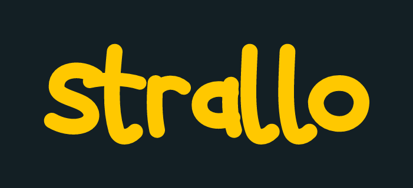
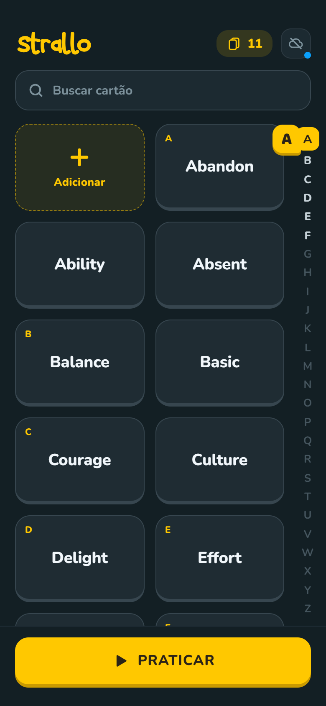
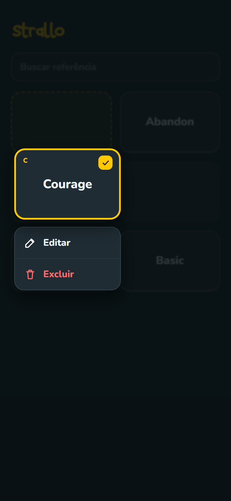
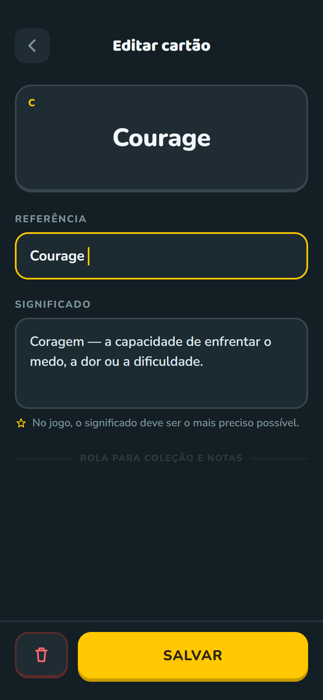
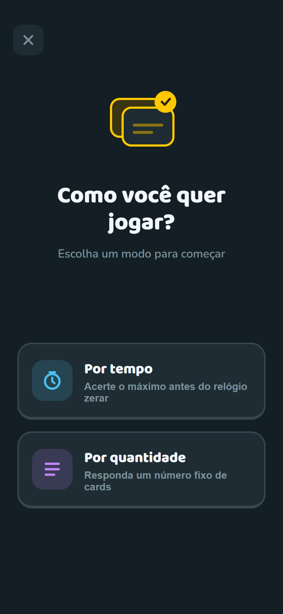
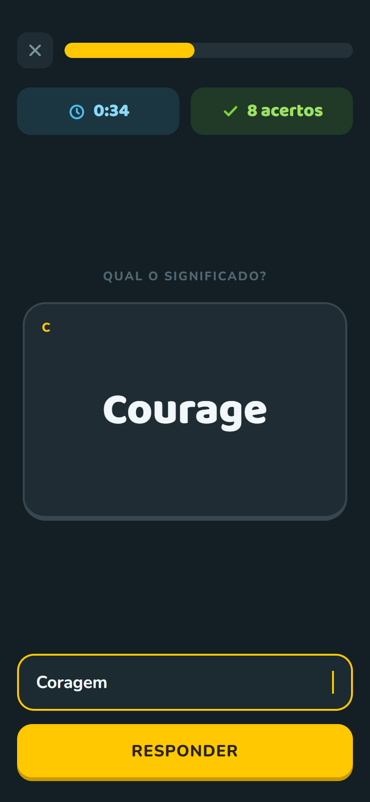
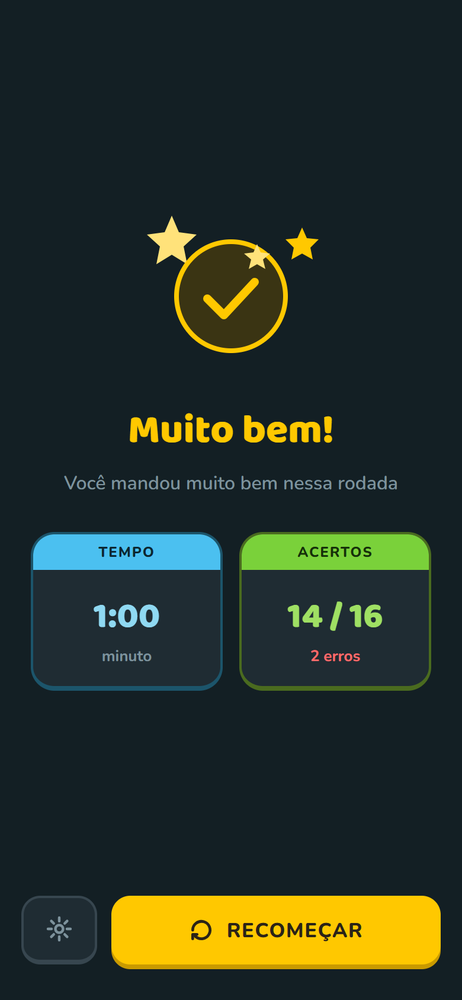

<div align="center">



Aplicativo de flashcards para memorização, com prática.

[](https://expo.dev)
[](https://reactnative.dev)
[](https://www.typescriptlang.org)

</div>

<br>

<div align="center">


&nbsp;

&nbsp;


</div>

## Objetivo

Estudar um flashcard no strallo é digitar o significado, não virar a carta e
supor que sabia a resposta. Cadastrar um cartão são dois campos, e encontrar
um entre centenas é imediato, pela busca ou pelo índice alfabético.

Os dados ficam no aparelho: o app funciona offline por completo.

## Funcionalidades

- ✅ Grade de cartões com agrupamento alfabético
- ✅ Índice alfabético lateral no lugar da barra de rolagem
- ✅ Busca por referência e por significado, ignorando acentos
- ✅ Criar, editar e excluir cartões
- ✅ Armazenamento local em SQLite, com migrações
- ✅ Modo de estudo por tempo ou por quantidade
- ⬜ Correção do significado por IA, aceitando respostas aproximadas
- ✅ Tela de resultados com acertos, erros e tempo

## Tecnologias

| Camada | Escolha |
| --- | --- |
| Runtime | Expo SDK 57 · React Native 0.86 · React 19 |
| Linguagem | TypeScript em modo `strict` |
| Navegação | Expo Router |
| Dados | expo-sqlite |
| Gráficos | react-native-svg |
| Tipografia | Nunito e Baloo 2 |
| Build | EAS Build |

Os componentes de interface são próprios, sem bibliotecas de UI, e leem os
tokens de [`src/theme.ts`](src/theme.ts).

## Design

As telas foram desenhadas antes de codadas. Os arquivos-fonte estão em
[`design/`](design/), e as imagens acima saem direto deles.

O fluxo de estudo já está desenhado, mas ainda não implementado:

<div align="center">


&nbsp;

&nbsp;


</div>

## Como rodar

Requer Node.js e yarn.

```bash
yarn install
yarn start
```

Leia o QR code com o app Expo Go. Para gerar um APK:

```bash
npx --yes --package eas-cli eas build --platform android --profile preview
```

`yarn typecheck` valida os tipos, `yarn icons` regenera os ícones e
`node scripts/generate-screens.mjs` recaptura as telas acima.

## Estrutura

```
app/                 rotas (expo-router)
  index.tsx            tela inicial
  card/[id].tsx        adicionar e editar cartão
src/
  theme.ts             tokens do design
  db/                  migrações e acesso aos cartões
  components/          componentes de interface
  utils/               normalização de texto e montagem da grade
design/                arquivos-fonte das telas
scripts/               geração de ícones e capturas
```
