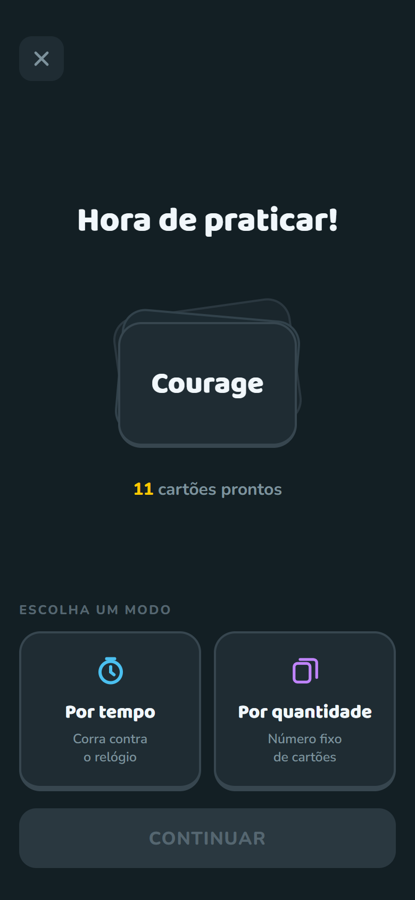
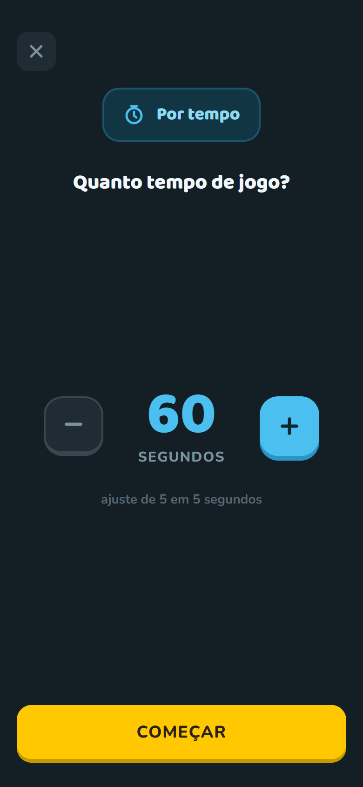
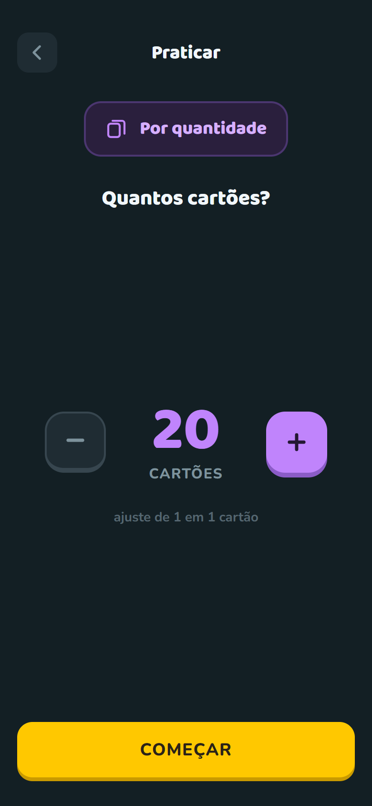
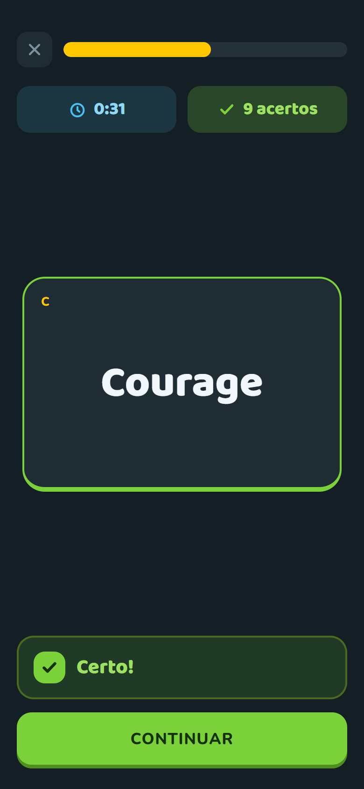
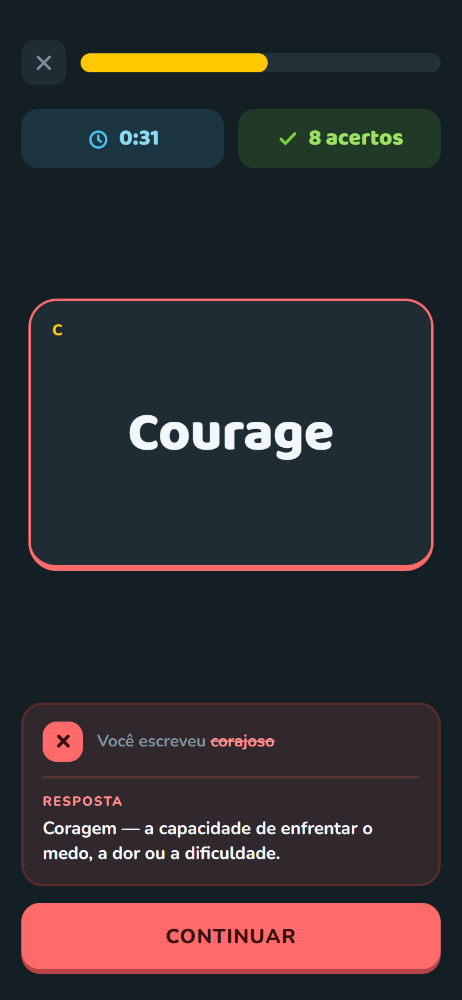

<div align="center">


Aplicativo de flashcards para memorização, com prática.

[](https://expo.dev)
[](https://reactnative.dev)
[](https://www.typescriptlang.org)
[](https://supabase.com)

</div>

<br>

<div align="center">


&nbsp;

&nbsp;


</div>

## Objetivo

Estudar um flashcard no strallo é digitar o significado, não virar a carta e
supor que sabia a resposta. Cadastrar um cartão são dois campos, e encontrar
um entre centenas é imediato, pela busca ou pelo índice alfabético.

Os dados moram no aparelho, e o app funciona offline por completo. Entrar com
o Google acrescenta uma **cópia na nuvem** que se reconcilia entre aparelhos —
é uma garantia contra perder o acervo, não o lugar onde ele passa a viver.

## Funcionalidades

- ✅ Grade de cartões com agrupamento alfabético
- ✅ Índice alfabético lateral no lugar da barra de rolagem
- ✅ Busca por referência e por significado, ignorando acentos
- ✅ Criar, editar e excluir cartões
- ✅ Recusa de referência repetida, ignorando caixa mas respeitando acento
- ✅ Armazenamento local em SQLite, com migrações
<br><br>

- ✅ Modo de prática por tempo ou por quantidade de cartões
- ✅ Tela de resultados com estatísticas de tempo, acertos e erros após o jogo
<br><br>

- ✅ Coleções para organizar cartões, com coleções dentro de coleções
- ✅ Seleção múltipla para agrupar, mover, editar e excluir
- ✅ Praticar só com os cartões de uma coleção
- ⬜ Compartilhar coleções de cartões
- ⬜ Salvar coleções de cartões compartilhados
<br><br>

- ✅ Login com Google
- ✅ Sincronização na nuvem, com o app seguindo offline
- ✅ Tela de conta com totais de cartões, coleções e práticas concluídas
<br><br>

- ⬜ Anexo de imagem para referência do cartão
<br><br>

- ⬜ Correção do significado por IA, aceitando respostas aproximadas
- ⬜ Responder no jogo com o microfone
<br><br>

- ⬜ Adicionar frases de exemplo para cada cartão
- ⬜ Modo de jogo usando frases

## Como a sincronização funciona

O SQLite do aparelho continua sendo a fonte de verdade. A nuvem guarda uma
cópia das mesmas linhas e as reconcilia quando há rede.

Cada linha carrega um **uuid** gerado no aparelho, porque o `id` autoincremental
é único em um banco e não entre bancos — dois celulares offline criariam o
mesmo número para cartões diferentes. Excluir **marca** a linha em vez de
apagá-la: sem a marca, o aparelho que ainda tivesse o cartão o devolveria na
sincronização seguinte, desfazendo a exclusão.

Em conflito vence a escrita mais recente. Coleções sobem e descem antes dos
cartões, já que um cartão aponta para a pasta onde mora.

A sincronização é disparada pelas próprias funções de escrita do banco, então
qualquer caminho que crie, edite ou exclua alguma coisa entra na fila — mais o
retorno do app ao primeiro plano e o momento do login.

## Tecnologias

| Camada | Escolha |
| --- | --- |
| Runtime | Expo SDK 57 · React Native 0.86 · React 19 |
| Linguagem | TypeScript em modo `strict` |
| Navegação | Expo Router |
| Dados locais | expo-sqlite |
| Nuvem | Supabase (Postgres com Row Level Security) |
| Autenticação | Google Sign-In + Supabase Auth |
| Gráficos | react-native-svg |
| Tipografia | Nunito e Baloo 2 |
| Build | EAS Build |

Os componentes de interface são próprios, sem bibliotecas de UI, e leem os
tokens de [`src/theme.ts`](src/theme.ts).

## Design

As telas foram desenhadas antes de codadas. Os arquivos-fonte estão em
[`design/`](design/), e as imagens abaixo saem direto deles.

<div align="center">


&nbsp;

&nbsp;


<br><br>


&nbsp;

&nbsp;


<br><br>


&nbsp;

&nbsp;


</div>

As telas de coleções e de conta ainda não estão nesta galeria — as capturas
saem das artboards por `node scripts/generate-screens.mjs`, que precisa de um
Chromium funcional.

## Como rodar

Requer Node.js e yarn.

```bash
yarn install
yarn start
```

Para gerar um APK:

```bash
npx --yes --package eas-cli eas build --platform android --profile preview
```

`yarn typecheck` valida os tipos, `yarn icons` regenera os ícones e
`node scripts/generate-screens.mjs` recaptura as telas acima.

### Nuvem (opcional)

Sem credenciais o app roda normalmente, offline, e a tela de Conta avisa que a
sincronização não foi configurada. Para ligá-la:

1. Rode [`supabase/schema.sql`](supabase/schema.sql) no SQL Editor do Supabase.
2. Copie [`.env.example`](.env.example) para `.env` e preencha as três
   variáveis.

O login com Google depende de módulo nativo, então **não funciona no Expo Go** —
é preciso um build próprio. As variáveis `EXPO_PUBLIC_*` são embutidas em tempo
de compilação: para uma build na nuvem elas precisam estar registradas no EAS,
não apenas no `.env` local.

## Estrutura

```
app/                 rotas (expo-router)
  index.tsx            tela inicial
  account.tsx          conta e sincronização
  card/[id].tsx        adicionar e editar cartão
  practice/
    index.tsx          escolher modo de prática
    config.tsx         configurar tempo ou quantidade
    play.tsx           rodada de prática em andamento
    results.tsx        resultado da rodada
src/
  theme.ts             tokens do design
  db/                  migrações e acesso a cartões, coleções e práticas
  cloud/               login, sincronização e estado da conta
  components/          componentes de interface
  utils/               normalização de texto, grade e árvore de coleções
design/                arquivos-fonte das telas
supabase/schema.sql    esquema e políticas da nuvem
scripts/               geração de ícones e capturas
```

## Licença

Este projeto é de código aberto para fins educacionais, estudo e uso pessoal.
A clonagem, inspeção e modificação privada do código são permitidas para uso não comercial.
O uso comercial, monetização ou redistribuição comercial por terceiros é **estritamente proibido** sem permissão expressa do autor.

Para mais detalhes, consulte o arquivo [LICENSE](LICENSE).
